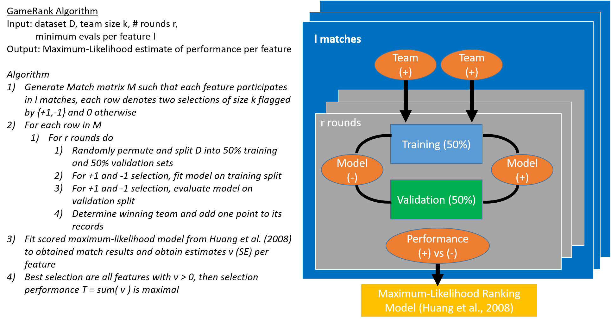

https://academic.oup.com/bioinformatics/pages/instructions_for_authors

Application Notes (up to 2 pages; this is approx. 1,300 words or 1,000 words plus one figure): Applications Notes are short descriptions of novel software or new algorithm implementations, databases and network services (web servers, and interfaces). Software or data must be freely available to non-commercial users. Availability and Implementation must be clearly stated in the article. Authors must also ensure that the software is available for a full two years following publication. Web services must not require mandatory registration by the user. Additional supplementary data can be published online-only by the journal. This supplementary material should be referred to in the abstract of the Application Note. If describing software, the software should run under nearly all conditions on a wide range of machines. Web servers should not be browser specific. Application Notes must not describe trivial utilities, nor involve significant investment of time for the user to install. The name of the application should be included in the title.

Sections of the manuscript
 Applications notes: Title page, Short Structured Abstract, Text.

Title page
 The title should be short, specific and informative, avoiding if possible version number and the words: tool, package, application, software (and similar). If novel software is being described, the name of the software should be included in the title. The surname and initials of each author should be followed by his/her department, Institution, city with postal code and country. Any changes of address may be added to the footnotes.

Structured Abstract (see recent issues of journal for examples)
Applications Notes
 Abstracts for Applications Notes are much shorter than those for an Original Paper. They are structured with four headings: Summary, Availability and Implementation, Contact and Supplementary Information.
 Summary: This section should summarize the purpose/novel features of the program in one or two sentences.
Availability and Implementation: See above for advice and examples for this section.
Contact: Full email address to be supplied, preferably an institutional address.
Supplementary information: Links to additional figures/data available on a web site, or reference to online-only Supplementary data available at the journal's web site.

# Title page

__Title:__ GameRank - A novel algorithm for wrapper-based feature selection

Carsten Henneges, Genentech Inc., 1 DNA Way, South San Francisco, CA 94080, United States

Joseph Nathaniel Paulson, Genentech Inc., 1 DNA Way, South San Francisco, CA 94080, United States

# Short Structured Abstract
__Motivation:__ In contrast to filter and embedded method approaches for feature selection, wrapper algorithms allow for direct optimization of model performance metrics through combinatorial search. This aspect is essential to building predictive models that are calibrated and show discrimination, which are both properties required for clincial applications. Due to the combinatorial optimization, wrappers are slow and do not guarantee global optimality of their selection.

__Results:__ Here we present a novel quick and maximum-likelihood-based wrapper algorithm, named GameRank, together with a R package comprising classical wrapper methods for building calibrated and discriminative predictive models.

__Availability and Implementation:__ GameRank is available at https://github.com/... and released under XXX License.

__Contact:__ Dr. Carsten Henneges (hennegc1@gene.com)

__Supplementary Information:__ Supplementary data are available at Bioinformatics online.

# Text (~930 words)

## Introduction (~380 words)

Current models used for predicting clinical outcomes of patients are required to demonstrate three properties: calibration, discrimination and clinical utility.    Calibration describes that predicted and observed outcomes are in agreement. Discrimination requires a model to meaningfully distinguish between patients with and without the need for medical intervention. Finally, clinical utility requires confirmation by a randomized controlled clinical trial that the application of the predictive model leads to superior clinical outcomes. [-@ici; -@calster; -@crowson; -@walsh]

Measures for calibration are hence amongst the first being evaluated when building clinical predictive models. For regression models they include the mean squared error, for binomial and survival models the measures entail percentiles of the mean absolute difference between observed and predicted probabilities, that is EC50, EC90 or even E_max, and the integrated calibration index (ICI). All of these require either estimation by cross-validation, bootstrap or being computed on a hold-out validation dataset.

Finally it is relevant to build models on as few clinical variables as possible, otherwise practical application might be severly limited. Thus careful variable selection - and also variable construction - is essential for successful predictive clinical modelling.

Variable selection can be clusterd into three methodological approaches: wrappers, filters and embedded methods.[-@guyon] Filters include statistical tests (e.g. parametric tests as the t-test or chi-squared tests, and non-parametric tests as wilcoxon-rank sum test) or distributional methods (e.g. to estimate the variable entropy). In general filters estimate useful statistical quantities for selection. Embbeded methods entail decision trees, random forests, Support Vector Machines with recursive feature elimination, shrinkage estimators (i.e., LASSO) or gradient boosting models where model fitting is intertwined with variable selection. Neither approach directly aims to optimize aforementioned calibration measures.

Wrapper algorithms on the other side tackle the combinatorial optimization by search strategies, at each step fitting a model and evaluating it's performance on training and validation data. Search strategies include random search, forward selection and backward selection searches. By keeping functions for model fitting and model evaluation as black box function, wrappers are flexible on both aspects and thus can be used to automatically build calibrated and discriminative predictive clinical models.

Here we publish an R package comprising a framework for wrapper-based clinical variable selection that includes a novel wrapper algorithm, named GameRank, which has been previously used to build a clinical predictive model for tolerability prediction of Cancer patients. [-@trial]
   
## GameRank algorithm (~270 words)

Most wrapper algorithms explore the search space by a strategy, e.g. adding or removing features in a sequential process, until reaching an optimum.
In contrast, the idea of GameRank is to first explore the search space by evaluating pairs of fixed size feature combinations against each other such that the predictive contribution of each feature can be quantified.

To do that, GameRank first generates a _feature learning dataset_ by random sampling feature selection of size $t$ and then comparing them for $r$ rounds on random 50:50 splits of the input data. One split is used to generate the model for the feature selection, the other is used to evaluate the model. The better model receives a score then. Note a model can be better by means of the objective function or by means of reliably producing models. Rounds stop if every feature has been evaluated at least $k$ times or a maximum of iterations has been reached.

All these comparisons are then used to estimate the Maximum-Likelihood (ML) model for ranking individuals by team comparisons published by [-@huang]. Due to the ML nature of this ranking model it is possible to obtain standard errors and confidence intervals per feature, quantifying the uncertainty in the ranking. Using the Delta method it is also possible to calculate confidence intervals for the strength of feature selections of interest. By means of ML theory this ranking estimate will be asymptotically consistent such that the size of the feature learning dataset determines the quality of the ranking in the long run.
Please see GameRank shown in the Figure for details.

### Figure 1 - GameRank algorithm

## R package and its usage (~210 words)

Aside of GameRank, our R package implements forward and backward selection as well as a random search algorithm for feature selection. These algorithms make use of at least one training and validation splits for determining selections. For all wrapper algorithms, two functions need to be provided: one that fits the model to given training data, and one that evaluates the metric on given validation data. We provide standard implementations for these functions for the regression, binary response and survival use cases. For binary and survival outcomes, calibration is estimated using methods comparing observed vs predicted probabilities, as described in *TBD Citation*.

Before variable selection makes sense, a thorough review of each included variable is essential. From our experience [-@trial], clinical variables are can be degenerate, show high distribution skew or may even be multi-modal. Therefore we provide packages to evaluate variable transformation (sqrt, cube root, log), if they increase Normality, produce Box-Cox transformations for regression and binary outcome scenarios, and detect multi-modality through Gaussian Mixture-Modelling with automatic model selection via the Akaike Information Criterion. If any distribution is found to be multi-modal, cut-points are determined and categorical variables are constructed automatically. For post-processing the selection, we have supplemented the package with functionality to determine influential observations. *TBD*

## Conclusion (~50 words)

This package is designed to comprise all necessary tools for successful and efficiently building clincial predictive models. It includes steps for variable construction, wrapper-based variable selection and model checking. All features are accompanied with examples and all model building steps are described in easy-to-run vignettes. 

## References

